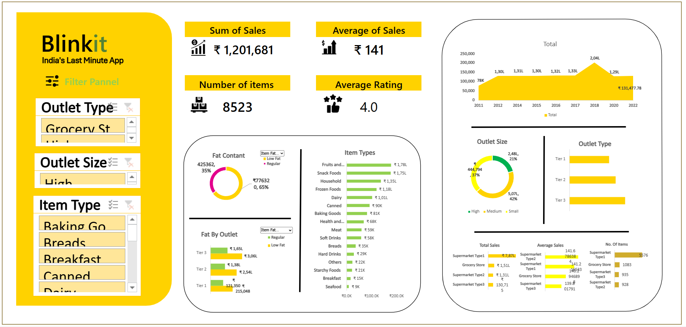

# 📊 Excel Sales Dashboard Project

This project is an **interactive Excel dashboard** created using Pivot Tables, Pivot Charts, and Slicers.  
It is inspired by the [DataTutorials YouTube Project](https://www.youtube.com/watch?v=klZj_282ApY).

---

## 🚀 Overview
The dashboard provides a clean and interactive way to analyze sales data.  
It highlights **KPIs, trends, and insights** that help in making better business decisions.

**Key Objectives:**
- Build a dynamic dashboard in Excel.
- Practice pivot tables, slicers, and custom number formatting.
- Learn dashboard design principles for data visualization.

---

## 🛠 Tools & Features
- **Excel (Desktop / Online)**  
- Pivot Tables & Pivot Charts  
- Slicers for interactive filtering  
- Conditional formatting for KPIs  
- Custom number formatting (`₹K`, `₹L`)  

---

## 📷 Dashboard Preview

---

## 📂 Project Files
- `Blinnkit Dashboard.xlsx` → Main interactive Excel dashboard  
- `Blinkit dashboard png.png` → Dashboard preview image  

---

## 📌 How to Use
1. Download `Dashboard.xlsx` from this repository.  
2. Open in Excel (Desktop recommended for full slicer and formatting support).  
3. Use the slicers to filter the data and explore insights.  

---

## 📈 Insights
Some examples of what the dashboard shows:
- Sales performance over time  
- Top-performing categories  
- Regional breakdown of sales  
- KPI cards for quick business overview  

---

## 🙌 Acknowledgments
This project was created while following the tutorial by [DataTutorials](https://www.youtube.com/watch?v=klZj_282ApY).  

---
  
